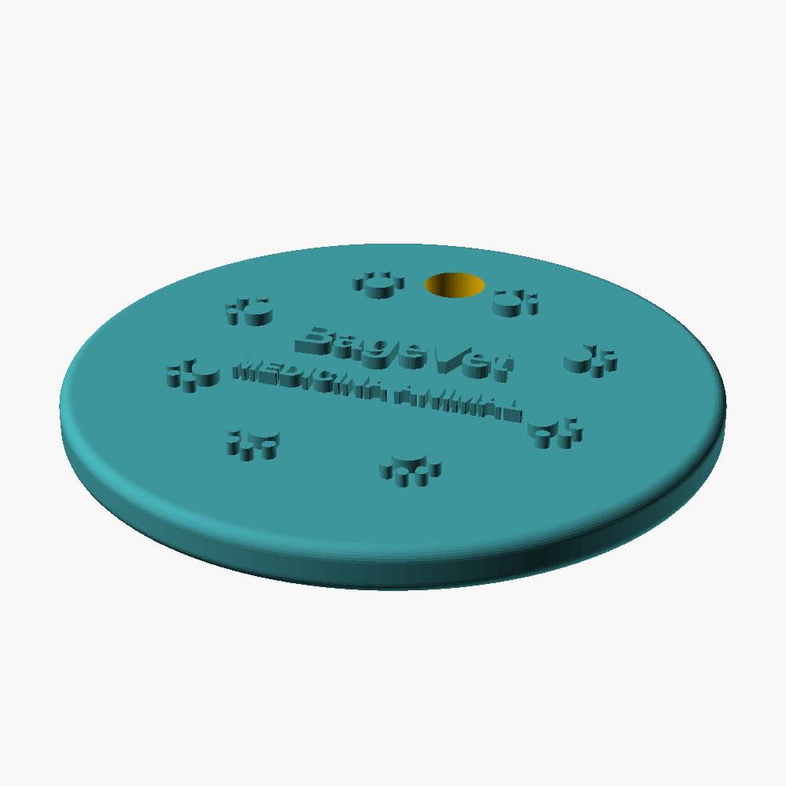
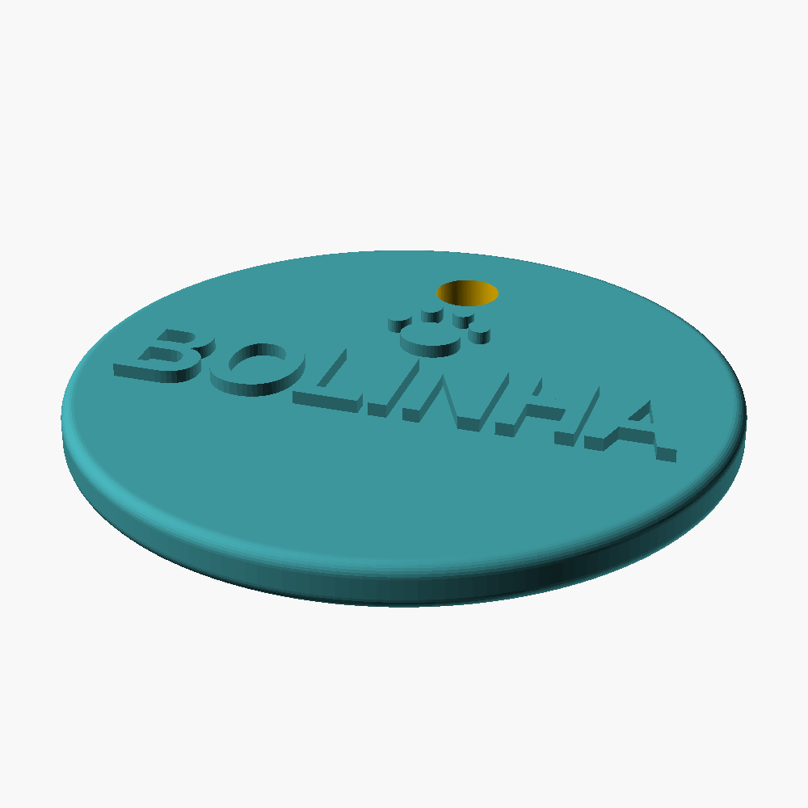

# Chaveiro BageVet — tag circular para impressão 3D

Modelo paramétrico de uma tag circular personalizável, pronta para impressão 3D.
A frente traz a marca (coroa de patinhas + `BageVet` + `MEDICINA ANIMAL`) e o
verso traz o nome do pet, que é um campo editável.




## Arquivos

| Arquivo | Descrição |
| --- | --- |
| `chaveiro_bagevet.scad` | modelo paramétrico (fonte editável, OpenSCAD) |
| `gerar_chaveiro.py` | gera o STL com o nome desejado, ajusta o texto e valida a malha |
| `stl/chaveiro_bagevet_BOLINHA.stl` | **peça pronta**, conforme a especificação |
| `stl/chaveiro_bagevet_LUNA.stl` | segundo exemplo de personalização |
| `stl/chaveiro_bagevet_BOLINHA_verso_baixo.stl` | variante com o verso gravado (imprime deitado, sem suporte) |
| `stl/chaveiro_bagevet_BOLINHA_corpo.stl` + `_detalhe.stl` | par para impressão em 2 cores (MMU/AMS ou troca de filamento) |

## Medidas (conferidas na malha exportada)

| Item | Valor |
| --- | --- |
| Diâmetro externo | 50,00 mm |
| Espessura do disco | 3,50 mm |
| Arredondamento da borda externa | raio 1,0 mm (toda a volta) |
| Furo da argola | Ø 5,00 mm, centro a 16,5 mm do centro |
| Borda do furo → borda externa | 6,00 mm |
| Logo da frente | Ø 34,0 mm, centralizada, relevo 1,0 mm |
| Nome do verso | letras de 8,0 mm de altura, relevo 1,0 mm |
| Patinha do verso | 8,0 mm de largura, acima do nome |
| Espessura total com os dois relevos | 5,50 mm |
| Malha | fechada (manifold), 50,00 × 50,00 × 5,50 mm, ~7,0 cm³ |

## Personalizar o nome

```bash
python3 gerar_chaveiro.py --nome LUNA
python3 gerar_chaveiro.py --nome "Júlio" --preview
python3 gerar_chaveiro.py --nome THOR --multicor
```

O script mede a fonte, mantém a altura das letras em 8 mm e, se o nome for
longo, aplica só a condensação horizontal necessária para não encostar na borda
(`BOLINHA`, por exemplo, sai com fator 0,852). Ele avisa e interrompe se o nome
exigir condensar demais. Depois de exportar, valida a malha (fechada, normais
consistentes, volume positivo).

Sem Python, dá para editar direto o `.scad`: a primeira linha do bloco
`[Personalizacao]` é `nome = "BOLINHA";`. Nesse caminho, confira nomes longos —
o ajuste automático de largura é feito pelo script.

Requisitos: `openscad` e `python3 -m pip install fonttools trimesh`
(`trimesh` só é usado na validação; `xvfb` só para gerar os PNGs num servidor).

## Impressão

- **Orientação**: deitado, furo para cima (`+Y`), sem suporte para a frente.
- **Camada**: 0,15–0,20 mm. O relevo de 1,0 mm dá 5 a 7 camadas.
- **Parede/preenchimento**: 3 perímetros, 20–30 %.
- **Bico**: 0,4 mm. Medidas críticas do desenho: o traço mais fino é o do
  subtítulo `MEDICINA ANIMAL`, com 0,48 mm (já engrossado no modelo); a menor
  folga entre os dedinhos das patinhas da coroa é 0,46 mm e cada dedinho tem
  0,88 mm — tudo acima do que um bico de 0,4 mm resolve. As letras do nome têm
  1,43 mm de traço e as de `BageVet`, 0,84 mm.
- **Argola**: o furo de 5 mm aceita argola de 20–25 mm.

### Sobre o alto-relevo nos dois lados

A peça principal segue a especificação: relevo positivo de 1 mm nas duas faces.
Deitada na mesa, ela apoia sobre as letras do verso, então o slicer vai pedir
suporte (ou uma balsa) nessa face. Há duas saídas prontas:

- `..._verso_baixo.stl` — mesmo modelo com o verso **gravado** em baixo-relevo
  de 1 mm. Imprime deitado, sem nenhum suporte, com 4,5 mm de espessura total.
  Gerado com `--modo-verso baixo`.
- `..._corpo.stl` + `..._detalhe.stl` — corpo e relevos separados, para imprimir
  em duas cores (verde + branco, como na referência). Basta carregar os dois
  arquivos na mesma posição e atribuir um filamento a cada um.

## Ajustes rápidos no `.scad`

| Parâmetro | Efeito |
| --- | --- |
| `nome` | nome do pet no verso |
| `texto_logo`, `texto_subtitulo` | textos da frente |
| `diametro`, `espessura`, `raio_borda` | geometria do disco |
| `relevo` | altura do relevo (mínimo recomendado 0,8 mm) |
| `furo_diametro`, `furo_margem` | furo da argola |
| `logo_diametro`, `n_patas`, `pata_coroa` | coroa de patinhas da frente |
| `altura_nome`, `nome_y`, `pata_verso` | composição do verso |
| `fonte` | fonte do texto (`"Liberation Sans:style=Bold"` por padrão) |
| `modo_verso` | `"relevo"` ou `"baixo"` |
| `parte` | `"completo"`, `"corpo"` ou `"detalhe"` |

Para manter a peça com 3,5 mm de espessura **total** (como na referência
impressa), use `espessura = 1.5` com `relevo = 1.0`.
