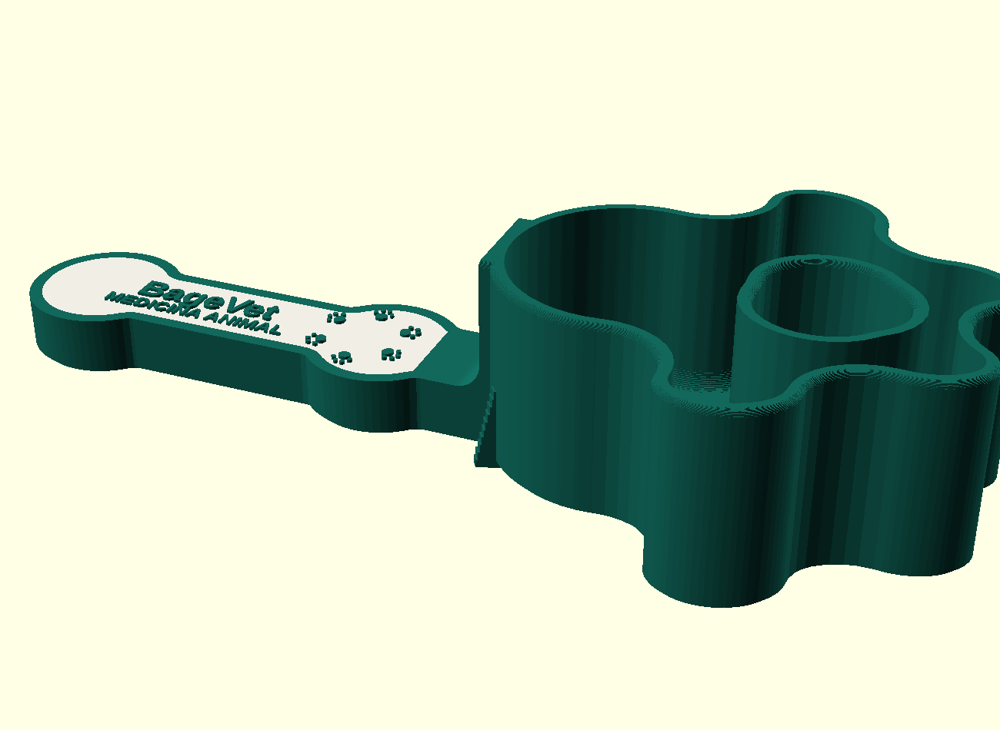

# Pegador de ração BageVet — brinde

Pegador de ração com concha em forma de pata e cabo em forma de osso, com a
marca BageVet em alto-relevo no cabo. Modelo paramétrico em OpenSCAD, pronto
para impressão 3D em uma cor, em multipartes (AMS/MMU) ou em 3MF colorido.



## Arquivos

| Arquivo | Descrição |
| --- | --- |
| `pegador_bagevet.scad` | modelo paramétrico (fonte editável) |
| `gerar_pegador.py` | gera todos os arquivos, valida as malhas e confere o fatiamento |
| `stl/pegador_bagevet.stl` | **peça única**, uma cor |
| `stl/pegador_bagevet_colorido.3mf` | **colorido**: as três partes num arquivo só, com as cores já atribuídas |
| `stl/pegador_bagevet_corpo.stl` | multipartes — corpo (cor 1) |
| `stl/pegador_bagevet_painel.stl` | multipartes — painel do cabo (cor 2) |
| `stl/pegador_bagevet_logo.stl` | multipartes — marca em relevo (cor 1) |

STL não guarda cor (nem nada de fatiamento — bico, camada e suporte são
escolhas do fatiador). Para imprimir colorido use o **3MF**, que já vem com os
três objetos e as cores; ou carregue os três STLs como um objeto com várias
partes e atribua um filamento a cada um.

```bash
python3 gerar_pegador.py            # gera tudo
python3 gerar_pegador.py --fatiar   # + confere o fatiamento com bico 0,4 mm
```

## Medidas (conferidas na malha exportada)

| Item | Valor |
| --- | --- |
| Comprimento total | 189,99 mm |
| Largura máxima (concha) | 85,00 mm |
| Altura total | 38,01 mm |
| Profundidade interna da concha | 35,00 mm |
| Fundo da concha | 3,00 mm |
| Parede da concha | 2,50 mm |
| Cabo | 100 mm de comprimento livre × 30 mm × 12 mm |
| Filete da junção cabo/concha | raio 5 mm |
| Nervuras externas | 3 × 2,0 mm de espessura, 3,5 mm de saliência |
| Concordâncias em planta | raio ≥ 2 mm (as da silhueta ficam em ~6 mm) |
| Coroa de patinhas da marca | Ø 22 mm, relevo 0,60 mm |
| Capacidade útil medida | 112 cm³ |
| Malhas | todas fechadas (manifold), com volume positivo |

### Duas observações sobre o briefing

- **Altura**: profundidade interna de 35 mm + fundo de 3 mm dão **38 mm**, e não
  os 45 mm pedidos — os dois números não fecham. Ficou com a cota funcional
  (35 mm de profundidade). Para chegar aos 45 mm de altura total, use
  `prof_interna = 42` no `.scad`; a capacidade sobe junto, para ~134 cm³.
- **Capacidade**: com 190 × 85 × 45 mm de envelope não dá para chegar aos
  120–150 g pedidos. A concha medida comporta **112 cm³**, ou seja ~45 g de
  ração seca (0,40 g/cm³) — uma meia-xícara, boa medida para brinde. Para
  ~130 g seria preciso ~320 cm³: dá para chegar lá escalando a peça inteira em
  1,4× (265 × 119 × 53 mm) ou aprofundando muito a concha. Diga qual caminho
  prefere que eu gero.

## Impressão

- **Orientação**: deitado, boca da concha para cima, exatamente como o modelo
  sai. Toda a peça apoia no leito (fundo da concha e cabo no mesmo plano).
- **Sem suportes**: não há nenhuma face pendente — paredes verticais, chanfro de
  45° na base, meia-cana no aro, filete e nervuras com saliência decrescente.
- **Fatiamento conferido** (PrusaSlicer, bico 0,4 mm, camada 0,2 mm, 3 paredes,
  20 % de preenchimento): peça única em 190 camadas, 50,5 cm³, ~4 h 36 min.
  Painel e marca saem em 3 camadas cada (0,6 mm).
- **Traços mínimos**: o subtítulo `MEDICINA ANIMAL` tem 0,63 mm de traço e a
  menor folga entre os dedinhos da coroa é 0,46 mm — ambos acima do que um bico
  de 0,4 mm resolve.
- **Material**: PETG ou PLA. Para contato com ração, prefira PETG e uma camada
  de verniz alimentício, ou lave só com pano úmido.

## Ajustes rápidos no `.scad`

| Parâmetro | Efeito |
| --- | --- |
| `comprimento_total`, `largura_max`, `concha_compr` | envelope da peça |
| `prof_interna`, `fundo`, `parede` | concha (profundidade, fundo e parede) |
| `cabo_compr`, `cabo_largura`, `cabo_espessura` | cabo |
| `filete_junta` | filete da junção cabo/concha |
| `concha_fundir` | quanto os dedos da pata se fundem na almofada |
| `nervura_*` | quantidade, posição e tamanho das nervuras |
| `logo_diam`, `logo_relevo`, `logo_x` | marca no cabo |
| `alt_marca`, `alt_sub` | altura das letras |
| `painel_borda`, `painel_prof` | painel colorido do cabo |
| `parte` | `"completo"`, `"corpo"`, `"painel"`, `"logo"` ou `"cavidade"` |
